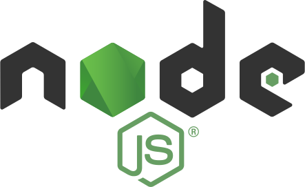

Table of Contents
---
- [Introduction](#introduction)
- [Features :zap:](#features-zap)
- [Technologies involved](#technologies-involved)
    - [**NodeJS**](#nodejs)
    - [**MongoDB**](#mongodb)
    - [**ProseMirror**](#prosemirror)
    - [**Nodemailer**](#nodemailer)
    - [**Express.js**](#expressjs)
    - [**Passport.js**](#passportjs)
    - [**Socket.io**](#socketio)
    - [**Bcrypt**](#bcrypt)
    - [**Bootstrap 4**](#bootstrap-4)
- [The DoX team 👨‍💻](#the-dox-team-)
- [Guide to compiling :rocket:](#guide-to-compiling-rocket)
    - [1. Install dependencies](#1-install-dependencies)
    - [2. Build the application](#2-build-the-application)
    - [3. Run the application](#3-run-the-application)
- [InternalWiki](#internalwiki)
---
# Introduction
The **DoX Editor** aims to be a web text editor application that allows users to create, edit, store and share several documents. 

DoX is clearly inspired to well known online word processors such as [**Google Docs**](https://docs.google.com/document/u/0/)
\
\
\
This project spans from *22 November 2021* to *20 December 2021* (28 days).\
Developed as part of the final group project for _Software Atelier 3: The Web SA 2020-2021_, part of BSc INF at USI Lugano.

# Features :zap:
**Create** and **edit** documents on a per-user basis.\
**Store** documents on the servers database.\
Real-time **collaborative editing** between users.\
**Document sharing** through **links** and/or by granting **permissions** to individual users.\
**Email confirmations** sent by the server through the DoX mailserver.\
Document VoIP call.


# Technologies involved
### [**NodeJS**](https://nodejs.org)
\
Main server-side code

### [**MongoDB**](https://www.mongodb.com)
\
Used to store the document and user data.

### [**ProseMirror**](https://prosemirror.net)
\
Toolkit for building rich-text editors, easily scalable and extensible.

### [**Nodemailer**](https://nodemailer.com/about/)
\
Allows the server to send email confirmations to the users that sign up on DoX.

### [**Express.js**](https://expressjs.com)
\
HTTP server handling all the routes and traffic.

### [**Passport.js**](https://www.passportjs.org)
\
Authenticates users and makes the Express routes behave based on evaluating the user's status and permissions.

### [**Socket.io**](https://socket.io)
\
Tracks active users on the site. Relays important database change events and synchronization data between users. Shares session data with Passport.js for  additional authentication. Fundamental for real-time collaborative editing.

### [**Bcrypt**](https://www.npmjs.com/package/bcrypt)
\
Hashing of user passwords.

### [**Bootstrap 4**](https://getbootstrap.com)
\
Responsive and pre-styled DOM elements.


# The DoX team 👨‍💻


|  |  |
|---|---|
|      | [Albert Cerfeda](https://github.com/AlbertCerfeda)  |
|   | [Alessandro Gobbetti](https://github.com/Alessandro-Gobbetti)  |
|   | [Denis Karev](https://github.com/actisPRO)  |
|     | [Bojan Lazarevski](https://github.com/BojanUSI)  |
|     | [Enrico Benedettini](https://github.com/Enrico-Benedettini)  |


# Guide to compiling :rocket:
### 1. Install dependencies
<!-- 
[Java SE 16 Download page](https://www.oracle.com/java/technologies/javase-jdk16-downloads.html) -->

After cloning the repo install all the required NPM modules.

```bash
npm install
```

### 2. Build the application
In order for the application to run, we first need to build some required components, one of which is the editor itself.
```bash
npm run build
```

### 3. Run the application
Finally run the application locally with
```bash
npm run local
```
\
You should be good to go now :smiling_imp:

# InternalWiki
[go to document](https://docs.google.com/document/d/1ts6U1XQcJ1OqRpBEreTGwxwOkUG8Nn1ytVDlmuXYpLI/edit?usp=sharing)
